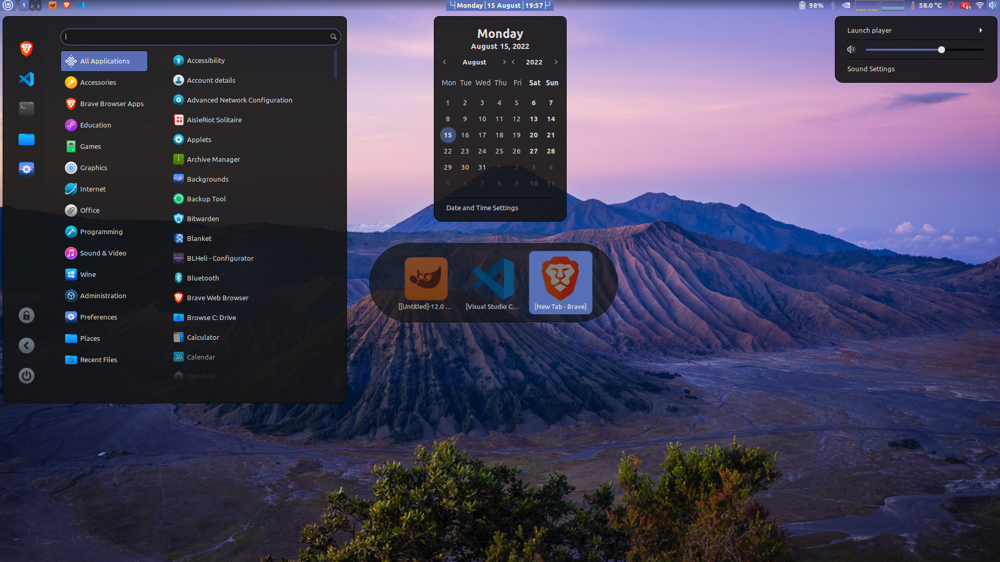

# Bdark Cinnamon Theme

Screenshot:

Icon theme is [Kora](https://www.gnome-look.org/p/1256209) ([Github](https://github.com/bikass/kora))

[Transparent Panel Extension](https://cinnamon-spices.linuxmint.com/extensions/view/81) for transparent panel

## Installation

Just clone this repo to `~/.themes/` folder. After that, you can select and use this theme from settings.